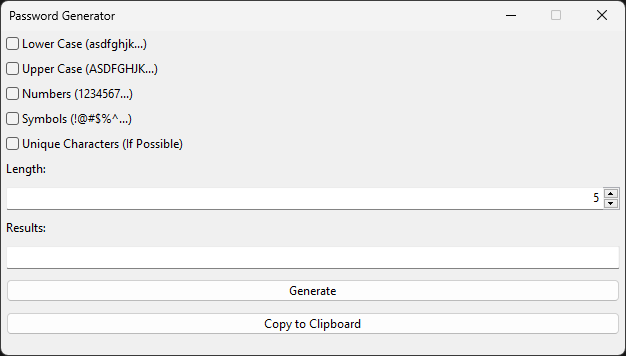

English

# rf_password_generator - Password Generator App

[README dengan Bahasa Indonesia Klik di Sini](https://github.com/rakifsul/rf_password_generator/blob/main/README_id.md)

## Intro

This application is a tool that can create passwords that are not easily guessed.

You can choose combinations of characters such as lowercase letters, uppercase letters, numbers, and symbols.

You can also make the password unique if possible.

## Where to Download

Download this app on "Releases" page.

## Where are the Source Codes

Source codes are included in the zip along with the executables.

## How to Use

Find the exe, then run it.

## Screenshot

	

## Freelance Worker Link

- https://projects.co.id/public/browse_users/view/99bc11/rakifsul

Bahasa Indonesia

# rf_password_generator - Aplikasi Password Generator

## Pendahuluan

Aplikasi ini adalah aplikasi yang dapat membuatkan password yang tidak mudah ditebak.

Anda bisa memilih kombinasi karakter seperti huruf kecil, huruf besar, angka, dan simbol.

Anda juga bisa membuat password-nya unik jika memungkinkan.

## Download di Mana

Download aplikasi ini di halaman "Releases".

## Di Mana Source Code-nya

Source code ada di dalam paket zip bersama executable-nya.

## Cara Penggunaan

Temukan exe-nya, lalu jalankan.

## Screenshot

	

## Freelance Worker Link

- https://projects.co.id/public/browse_users/view/99bc11/rakifsul

